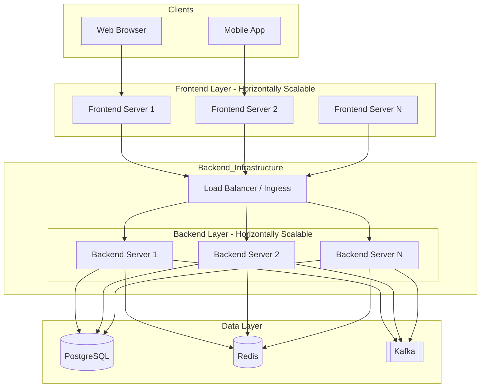

# System Architecture

### Components Description

1.  **Frontend Layer**: These servers host the static assets (React/Vite) or handle Server-Side Rendering (SSR). They can be scaled horizontally behind a CDN or another global load balancer.
2.  **Load Balancer**: Distributes incoming API traffic from the frontend/clients across the healthy backend instances.
3.  **Backend Layer (Rust)**: The application logic, scaled horizontally. Since they are stateless (state is in DB/Cache), we can spin up as many instances as needed.
4.  **PostgreSQL**: The primary relational database for persistent storage.
5.  **Redis**: Used for caching, session management, or as a message broker to reduce DB load and improve performance.
6.  **Kafka**: Distributed event streaming platform used for asynchronous communication, event-driven architecture, or log aggregation.
