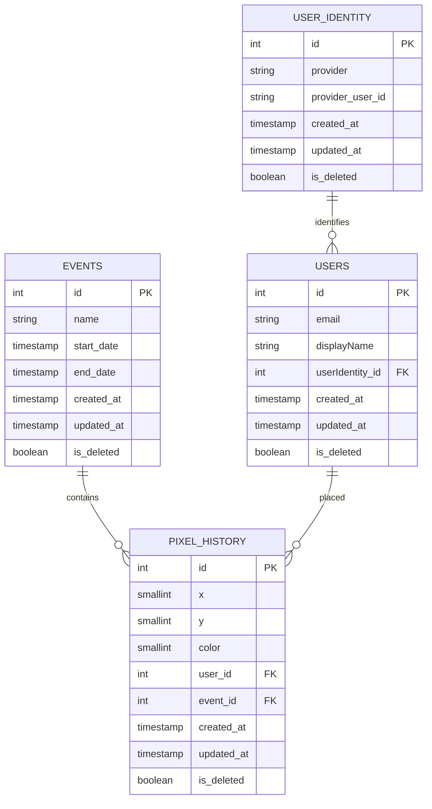

# Database Schema Design

This document outlines the entity-relationship structure for the PixPlace application.

## Entity Relationship Diagram

## Table Definitions

### 1. Events
- `id`: Primary Key
- `name`: Event name
- `start_date`: Start timestamp
- `end_date`: End timestamp
- `created_at`: Creation timestamp
- `updated_at`: Last update timestamp
- `is_deleted`: Boolean flag for soft deletion

### 2. Users
- `id`: Primary Key
- `email`: User email
- `displayName`: Public display name
- `userIdentity_id`: Foreign Key to `USER_IDENTITY`
- `created_at`: Creation timestamp
- `updated_at`: Last update timestamp
- `is_deleted`: Boolean flag for soft deletion

### 3. User Identity
- `id`: Primary Key
- `provider`: Auth provider name (e.g., google, github)
- `provider_user_id`: Unique ID from the provider
- `created_at`: Creation timestamp
- `updated_at`: Last update timestamp
- `is_deleted`: Boolean flag for soft deletion

### 4. Pixel History
- `id`: Primary Key
- `x`: X-coordinate (SMALLINT)
- `y`: Y-coordinate (SMALLINT)
- `color`: Color value (SMALLINT)
- `user_id`: Foreign Key to `USERS`
- `event_id`: Foreign Key to `EVENTS`
- `created_at`: Creation timestamp
- `updated_at`: Last update timestamp
- `is_deleted`: Boolean flag for soft deletion
